# Impact of Feature Selection on Linear Regression

## 📝 Project Description
Evaluating the impact of Filter, Wrapper, and Embedded Feature Selection techniques on a Linear Regression baseline. 
The project analyzes changes in predictive accuracy ($R^2$, RMSE) and overfitting mitigation using benchmark structured datasets. 
Built with Python and Scikit-learn.

## 🛠️ System Architecture & Pipeline Schema

The system is designed as an end-to-end automated machine learning pipeline with an embedded experimental loop to systematically evaluate the impact of different feature configurations.

```mermaid
graph TD
    %% Data Ingestion Layer
    RawData[(data/raw/)] -->|Ingest Dataset| DataLoader(src/data_loader.py)
    DataLoader -->|Raw DataFrame| Preprocess(src/preprocess.py)
    Preprocess -->|Persist Clean Data| ProcessedData[(data/processed/)]
    
    %% Feature Selection Loop (Experimental Stage)
    Preprocess -->|Feature Vectors| FeatureSelector{{src/feature_selector.py}}
    
    subgraph Experimental Evaluation Loop [Managed by Pipeline Engine]
        FeatureSelector -->|Config A:<br>100% Features| ModelBaseline(src/model.py - Baseline)
        FeatureSelector -->|Config B:<br>Subsets Filter/Wrapper/Embedded| ModelOptimized(src/model.py - Optimized)
    end
    
    %% Evaluation & Academic Reporting Layer
    ModelBaseline -->|Extract Performance Metrics| Evaluate[Model Benchmarking: R², RMSE]
    ModelOptimized -->|Extract Performance Metrics| Evaluate
    
    Evaluate -->|Export Artifacts & Figures| Reports[(reports/)]

    %% Schematic Formatting
    style RawData fill:#1e1e2e,stroke:#a6adc8,stroke-width:1px
    style ProcessedData fill:#181825,stroke:#89b4fa,stroke-width:1px
    style Reports fill:#181825,stroke:#a6e3a1,stroke-width:1px
    style FeatureSelector fill:#181825,stroke:#fab387,stroke-width:1px
```

## 👥 Team Members (AI Vietnam_UntitledTeam - Module 1)
- **Đào Trung Can** (Leader / AI Engineer - Pipeline)
- **Lê Hoàng Trọng Minh** (Tech Leader)
- **Tùng Nguyễn** (AI Engineer - Data)
- **Cao Bá Hoàng** (AI Engineer - Model)
- **Trần Phương Bình** (QA / Reviewer)

## 📁 Repository Structure
- `data/`: Contains raw and processed datasets.
- `notebooks/`: Contains Jupyter notebooks for EDA and experimental modeling.
- `src/`: Core source code for the automated data and modeling pipeline.
- `reports/`: Technical documentation, figures, and presentation materials.

## 🚀 How to Run
(To be updated in Sprint 4)

## 📊 Results Summary
(To be updated in Sprint 3)
